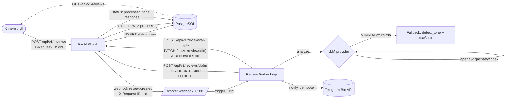

# Reviews: парсер и анализатор

[](https://github.com/Edwards359/reviews-parser-analyzer/actions/workflows/ci.yml)
[](https://www.python.org/downloads/release/python-3120/)
[](LICENSE)
[](https://github.com/astral-sh/ruff)

Два сервиса в одном репозитории.

- `app_test_2803-main/` — веб-приложение на FastAPI: хранит отзывы, отдаёт API и UI.
- `worker_ai-main/` — фоновый ассистент: забирает новые отзывы, определяет тональность, генерирует ответ через LLM (OpenAI / GigaChat / YandexGPT) и публикует его в приложении.

## Поток данных



Ключевые инварианты потока:

- Один `X-Request-ID` (cid) проходит сквозь UI → web → webhook → worker → обратные вызовы worker → web и попадает во все логи обеих сторон.
- `claim` атомарен: несколько воркеров получают непересекающиеся пачки (`FOR UPDATE SKIP LOCKED`).
- Telegram-уведомление идемпотентно: `state.json` хранит уже уведомлённые `review_id`.
- Если LLM-провайдер упал — processor прозрачно откатывается на эвристический fallback.

## Ключевые особенности реализации

1. **Безопасность API.** Служебный эндпоинт `/api/v1/reviews/ai-reply` под `X-Worker-Token`; флаг `is_ai` ставит сервер, клиент не может подделать «AI»; публичный POST защищён rate-limit и дедупом.
2. **Атомарный claim.** Новый эндпоинт `/api/v1/reviews/claim` использует `FOR UPDATE SKIP LOCKED`; статусы `new → processing → processed/failed` — несколько worker-инстансов не конфликтуют.
3. **Миграции Alembic.** Схема БД ведётся миграциями; при старте контейнера прогоняется `alembic upgrade head`.
4. **Модульные LLM-провайдеры.** Под общий интерфейс `LLMProvider` реализованы `OpenAI`, `GigaChat`, `YandexGPT`, `Fallback`. Переключение через `LLM_PROVIDER`.
5. **Структурированный ответ LLM.** Единый JSON `{tone, reply}` — одним вызовом и тональность, и ответ.
6. **Ретраи.** `tenacity` вокруг сетевых вызовов (приложение и LLM).
7. **Push вместо опроса.** Webhook от приложения к worker (`/webhook/review-created`) разблокирует цикл, polling остался как fallback.
8. **Наблюдаемость.** Сквозной `X-Request-ID` (cid) пробрасывается web → webhook → worker → обратные вызовы worker → web, попадает во все логи. Health-эндпоинты `/healthz`, `/readyz`, Prometheus-эндпоинты `/metrics` на обоих сервисах.
9. **Prometheus-метрики.** HTTP-latency и код возврата на каждом роуте, счётчики созданных/обработанных/failed отзывов, latency LLM по провайдерам, исходы Telegram-уведомлений, gauge по статусам в БД.
10. **Dead-letter / retry.** Колонки `retry_count` и `last_error`, эндпоинт `POST /api/v1/reviews/{id}/retry` (ограничен `MAX_RETRY_COUNT`) ставит failed-отзыв обратно в `new` и дёргает webhook воркера.
11. **UI-улучшения.** Бейдж `AI`, расширенные статусы, устойчивость к будущим значениям.
12. **Docker.** Multi-stage сборка, non-root пользователь, `HEALTHCHECK`, единый `docker-compose.yml` с профилями (`worker`, `observability` с Prometheus).
13. **OpenAPI.** Теги `public / worker / health / legacy`, summary/description, примеры payload в schemas → читаемый Swagger в `/docs`.
14. **Тесты.** 37+ pytest-кейсов: `tone`, `parse_llm_response`, `state`, идемпотентность Telegram, fallback LLM-провайдера, legacy- и v1-роуты, проброс `X-Request-ID`, dead-letter/retry (на SQLite), Prometheus-метрики, атомарность `claim` на настоящем Postgres через testcontainers. CI на GitHub Actions гоняет `ruff check` + `pytest`.

## Быстрый запуск (Docker)

```bash
cp app_test_2803-main/.env.example app_test_2803-main/.env
cp worker_ai-main/.env.example worker_ai-main/.env
# выставить WORKER_API_TOKEN одинаковым в обоих .env

docker compose up --build -d                                    # только приложение + БД
docker compose --profile worker up --build -d                   # + worker
docker compose --profile worker --profile observability up -d   # + Prometheus на :9090
```

- UI/API: `http://127.0.0.1:8000/`
- Swagger: `http://127.0.0.1:8000/docs`
- Метрики приложения: `http://127.0.0.1:8000/metrics`
- Метрики воркера: `http://127.0.0.1:8100/metrics`
- Prometheus: `http://127.0.0.1:9090/`

## Локальная разработка

Целевой интерпретатор — **Python 3.12** (тот же, что и в Docker-образе `python:3.12-slim`).
Зафиксирован в `.python-version` и `pyproject.toml`. На 3.12 есть готовые wheels для
всех используемых библиотек (SQLAlchemy 2, asyncpg, psycopg, pydantic-core, openai,
httpx, tenacity, alembic) — установка не требует компиляции.

Создать venv и поставить все зависимости:

```powershell
py -3.12 -m venv .venv
.\.venv\Scripts\python.exe -m pip install --upgrade pip
.\.venv\Scripts\python.exe -m pip install -r app_test_2803-main\requirements.txt -r worker_ai-main\requirements.txt pytest pytest-asyncio aiosqlite testcontainers ruff mypy python-docx docx2pdf
```

Проверка:

```powershell
.\.venv\Scripts\python.exe -m pytest tests\ -q
.\.venv\Scripts\python.exe -m ruff check app_test_2803-main worker_ai-main tests
```

## Структура

```text
app_test_2803-main/   # FastAPI, PostgreSQL, Alembic, /metrics, /docs
worker_ai-main/       # worker + LLM провайдеры + webhook-сервер + /metrics
deploy/prometheus.yml # scrape-конфиг Prometheus
tests/                # pytest (+ testcontainers Postgres)
docker-compose.yml    # web+db, worker (профиль worker), prometheus (профиль observability)
pyproject.toml        # ruff / pytest / mypy
```

## Наблюдение в продакшене

- Веб: `GET /metrics` отдаёт Prometheus-метрики (`reviews_http_*`, `reviews_created_total`,
  `reviews_claimed_total`, `reviews_retry_total`, `reviews_status_current`).
- Воркер: `GET /metrics` (порт 8100) — `worker_reviews_processed_total{tone}`,
  `worker_reviews_failed_total`, `worker_llm_requests_total{provider,outcome}`,
  `worker_llm_latency_seconds{provider}`, `worker_telegram_notifications_total{outcome}`.
- Prometheus в `docker-compose --profile observability` скрейпит обе цели раз в 15 секунд.
- Для retry упавшего отзыва: `POST /api/v1/reviews/{id}/retry` с `X-Worker-Token`. Лимит — `MAX_RETRY_COUNT` (по умолчанию 5).
- State воркера имеет двойной лимит: `STATE_MAX_ENTRIES` (FIFO, по умолчанию 10000) и `STATE_MAX_AGE_DAYS` (по умолчанию 30). Любое из значений = 0 отключает соответствующее ограничение. Метрика `worker_state_entries` показывает текущий размер.
